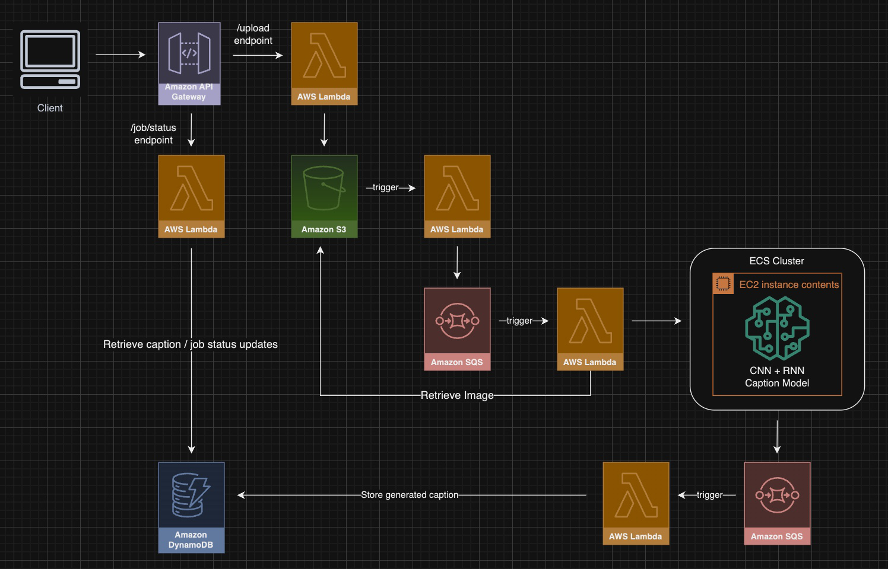

# CLAPTION - Clothing Image Caption Service

This is a clothing captioning service for people to generate titles for their eBay/Poshmark listings. Given a cover photo for the listing, relevant features will be extracted and returned as a caption.

## Table of Contents

- [CLAPTION - Clothing Image Caption Service](#claption---clothing-image-caption-service)
  - [Table of Contents](#table-of-contents)
  - [Overview](#overview)
  - [Technologies](#technologies)
  - [System Design](#system-design)
    - [Upload and Caption Image](#upload-and-caption-image)
      - [`/upload` endpoint](#upload-endpoint)
      - [S3 trigger](#s3-trigger)
      - [Process image SQS trigger](#process-image-sqs-trigger)
      - [ECS cluster](#ecs-cluster)
      - [Dockerized model](#dockerized-model)
      - [Status update SQS queue](#status-update-sqs-queue)
      - [Status update SQS trigger](#status-update-sqs-trigger)
      - [DynamoDB](#dynamodb)
    - [Caption Job Status Polling](#caption-job-status-polling)
      - [`/job/status/{jobID}` endpoint](#jobstatusjobid-endpoint)
      - [Lambda request handler](#lambda-request-handler)
    - [Error Handling](#error-handling)
    - [IAM Roles/Policies](#iam-rolespolicies)
  - [Front-end](#front-end)

## [Overview](#overview)

The user sends an image of the clothing item. This image will be passed through a PyTorch model consisting of a Convolutional Neural Network and Recurrent Neural Network. The CNN extracts features from the image, and then the RNN generates the caption using this feature information. For more info on how this model is structured and was trained, see this repository (TODO: HYPERLINK).

## [Technologies](#technologies)

For the backend, a serverless microservices architecture is employed using AWS and Go AWS SDK. This includes S3, SQS, DynamoDB, Lambda, and ECS. I used PyTorch for the model, Docker to containerize it, and Flask to interact with this image. The frontend is built with Next.js, TypeScript, and Tailwind CSS.

## [System Design](#system-design)

### Upload and Caption Image

#### `/upload` endpoint

This is a POST endpoint exposed using AWS API Gateway and expects a base64 encoding for the image. A Lambda function (`/go-aws/pkg/lambdas/upload_handler.go`) is used to handle requests for this endpoint. The base64 encoding and a UUID is stored into S3. The endpoint returns this UUID back to the frontend, so it can be used to retrieve information from our DynamoDB.

#### S3 trigger

Once image details are uploaded to S3, another Lambda (`/go-aws/pkg/lambdas/image_upload_trigger.go`) is triggered that sends a process request for this image to an SQS queue. With this SQS queue, we can better handle our asynchronous requests. The process request message sent to the SQS will contain image details information, which is the bucket and key (UUID) for the image.

#### Process image SQS trigger

When our processing SQS queue receives a message, another Lambda (`/go-aws/pkg/lambdas/process_message.go`) is triggered to process this request. It will retrieve the image from S3 using the key (UUID). Then, the image is passed into our model.

#### ECS cluster

Our model is dockerized and uploaded to AWS ECR. The ECS runs the docker image on a t2.micro EC2 instance.

#### Dockerized model

The Python application (`/caption/handler.py`) exposes an endpoint in the Docker image using Flask. When an image is uploaded to this endpoint, it gets passed through the PyTorch model and outputs the caption.

#### Status update SQS queue

Another SQS queue handles our caption job updates, including when the caption generation is complete and when we run into errors. We have a standardized `CaptionJob` model (`/go-aws/pkg/models/caption_job.go`) that the queue expects.

#### Status update SQS trigger

After receiving an update message, a Lambda (`/go-aws/pkg/lambdas/status_message.go`) is triggered to upload the update to our DynamoDB. In the `CaptionJob` model, the UUID is used to specify which job we want to update the status for.

#### DynamoDB

The table uses `JobID` (the key/UUID) as the partition key. Each entry is structured the same as our `CaptionJob` model.

### Caption Job Status Polling

#### `/job/status/{jobID}` endpoint

A GET endpoint is exposed on AWS API Gateway. The `jobID` path argument is used to query DynamoDB for the `CaptionJob` information. 

When we call `/upload`, a caption job begins and the job ID is returned back to the client. Once this is received, we call `/job/status` to begin polling DynamoDB for our job status.

#### Lambda request handler

Calling the endpoint triggers a Lambda (`/go-aws/pkg/lambdas/get_status_handler.go`) that will begin querying our DB. The captioning process happens relatively quick, so the Lambda will make 3 attempts with 1 second in between. If the job status isn't found to be "Completed" or "Failed" within these attempts, it tells the client that the job is not yet complete and to try again later.

### Error Handling

Our job status SQS queue is also used by our services whenever errors occur. In `CaptionJob`, we have an optional field for error, which maps to a `CaptionError` model. In this model, we have information about what stage the error happened, more specific context about what we attempted to do when the error happened, and the original error itself. When we run into an error, we call `HandleError` which uses `SendUpdateStatusMessage` to send a message to our job status SQS. From here, the new `CaptionJob` is uploaded to our DynamoDB with the "Failed" status and the error details.

### IAM Roles/Policies

IAM policies were made to define permissions for interacting with our different services (S3, SQS, DynamoDB). A role is made for each Lambda that gets assigned the appropriate policies.

## [Front-end](#front-end)

Our front-end uses a reducer that handles our page state. Our reducer has three actions: `SET_DISPLAY`, `RESET_DISPLAY`, `SET_ERROR`. `SET_DISPLAY` sets an image and caption to be displayed on our page. `RESET_DISPLAY` will display the file upload section. `SET_ERROR` is used to display an error message on the file upload section.

We have two Next.js API routes defined: `/api/caption` and `/api/job/status[jobID]`. Our caption route takes in the user uploaded image and makes a call to our AWS route. After this call is made, our status polling endpoint is called to retrieve the caption/error.

